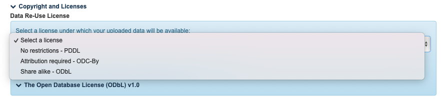

# Old Licence mappings \[EN]

## License mappings

| Back-office                                                                                                                                                                                                                    | Front-office (same as OAI -> GISMO -> FRIS)                                                                        | Location                            | Info                                                                                                                                                            | Old back-office                                                                                                                                                                                                                          |
| ------------------------------------------------------------------------------------------------------------------------------------------------------------------------------------------------------------------------------ | ------------------------------------------------------------------------------------------------------------------ | ----------------------------------- | --------------------------------------------------------------------------------------------------------------------------------------------------------------- | ---------------------------------------------------------------------------------------------------------------------------------------------------------------------------------------------------------------------------------------- |
| `Empty selection`                                                                                                                                                                                                              | **No license (in copyright)**                                                                                      | 📃Publications                      | 
<em>Reason: in the past this one has been used to indicate "other license" as well.</em>  <em>Datasets does not allow for an empty selection.</em>
 | `Empty selection`                                                                                                                                                                                                                        |
| **No license (in copyright)**                                                                                                                                                                                                  | **No license (in copyright)**                                                                                      | 📃Publications                      | _Reason: both old license options meant "there is no license, no reuse"_                                                                                        | 
<strong>I have retained and own the full copyright for this publication</strong>  <strong>I have transferred the copyright for this publication to the publisher</strong>   <code>The above options are merged</code>
 |
| **I don’t know the status of the copyright for this publication**                                                                                                                                                              | **Information pending**                                                                                            | 📃Publications                      | /                                                                                                                                                               | I don't know the status of the copyright for this publication                                                                                                                                                                            |
| 
Publications: <strong>The license is not in this list</strong>  Datasets: <strong>The license is not in this list +</strong> the value that has been entered in the <strong>"other license"</strong> field.
 | **A specific license has been chosen by the rights holder. Get in touch with the rights holder for reuse rights.** | 
📃Publications 🔢Datasets
 | _In the future, FRIS would like to receive the "other license" field for datasets. This is currently not the case. See further notes._                          | `Not an option in the old back-office`                                                                                                                                                                                                   |
| CC license option\*                                                                                                                                                                                                            | _Shows the chosen license e.g. Creative Commons Attribution 4.0 International Public License (CC-BY 4.0)\*_        | 
📃Publications 🔢Datasets
 | _FRIS use the SPDX ID standard. Translations are made somewhere (GISMO? FRIS); we might have to adapt in the future so we can follow the standard._             | CC license option\*                                                                                                                                                                                                                      |

## Old Biblio

<figure><figcaption>
Publications: adapted
</figcaption></figure>

<figure><figcaption>
Datasets: completely replaced
</figcaption></figure>
