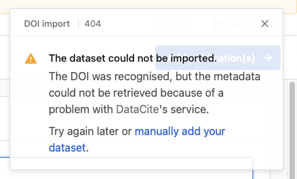

# Help, deze DOI werkt niet

## Context

De metadata die binnengetrokken wordt in Biblio via DOI, verloopt via twee diensten: [Crossref](https://www.crossref.org) (publicaties) en [DataCite](http://datacite.org) (datasets). Dat zijn twee betrouwbare bronnen waar we informatie mee kunnen uitwisselen.

Je kan altijd checken of een DOI werkt, door de Crossref of DataCite website te gebruiken:

* **Crossref**\
  Gebruik de site [https://search.crossref.org](https://search.crossref.org) en zoek\
  of stel een link samen om de inhoud te checken: api.datacite.org/dois/plak-hier-de-DOI
* **DataCite**\
  Gebruik de site [https://commons.datacite.org](https://commons.datacite.org)\
  of stel een link samen om de inhoud te checken: api.crossref.org/works/plak-hier-de-DOI

Wanneer het niet werkt, zijn er enkele redenen:

### Reden: de DOI is (nog) niet beschikbaar

Wat zal je zien in Biblio:

<figure><figcaption>
Publicaties
</figcaption></figure>

<figure><figcaption>
Datasets
</figcaption></figure>

#### Omdat...

1. **DOI is nog niet actief**\
   Soms duurt het even voor een DOI via een uitgever actief wordt bij Crossref of DataCite. Je kan dan later nog eens proberen.
2. **DOI van een onbetrouwbare bron**\
   Buiten Crossref en DataCite zijn er nog bronnen die een DOI aanbieden. Dat zijn bijvoorbeeld onafhankelijke publicatiehuizen. Deze informatieuitwisseling kunnen we niet duurzaam implementeren omdat die lijst eindeloos kan zijn, en omdat ze andere regels en contracten hanteren.

**Oplossing**

Indien de onderzoeksoutput niet terecht kan komen op een DOI die door Crossref of DataCite erkent kan worden, kunnen ze&#x20;

* Even wachten tot de DOI actief is, later opnieuw proberen
* Onderzoeker kan uitgeverij contacteren
* Importeren via BibTex of WoS indien beschikbaar
* Manueel aanvullen

### Reden: de uitwisseling van metadata is niet mogelijk bij Crossref of DataCite

Wat je zal zien in Biblio:

&#x20;

<figure><figcaption>
Publicaties
</figcaption></figure>

<figure><figcaption>
Datasets
</figcaption></figure>

#### Omdat...

De API, het uitwisselingsprotocol van Crossref of DataCite, is kapot.

#### Oplossingen

* Later opnieuw proberen
* Importeren via BibTex of WoS indien beschikbaar
* Manueel aanvullen

### Reden: het specifieke record kan niet binnengetrokken worden&#x20;

Wat je zal zien in Biblio:

&#x20;

<figure><figcaption>
Publicaties
</figcaption></figure>

<figure><figcaption>
Datasets
</figcaption></figure>

#### Omdat...

Crossref of DataCite herkende de DOI, maar kon het record zelf niet bereiken.

#### Oplossingen

* Later opnieuw proberen
* Importeren via BibTex of WoS indien beschikbaar
* Manueel aanvullen

### Reden: de inhoud van de DOI kan niet binnengetrokken worden in Biblio

Wat je zal zien in Biblio:

<figure><figcaption>
Publicaties
</figcaption></figure>

<figure><figcaption>
Datasets
</figcaption></figure>

#### Omdat...

De DOI werd herkend in Crossref of DataCite en ze konden het record vinden, maar de informatie er in is niet leesbaar.

#### Oplossingen

* Later opnieuw proberen
* Importeren via BibTex of WoS indien beschikbaar
* Manueel aanvullen
