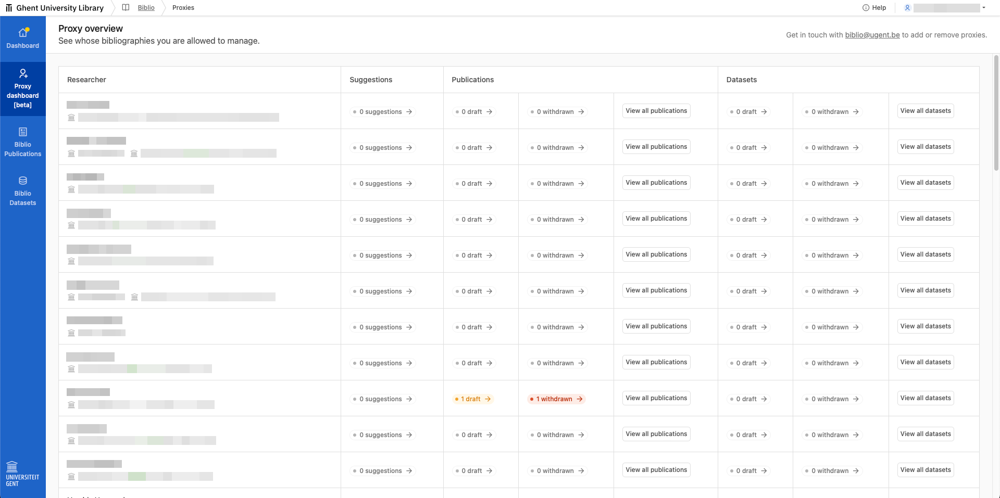
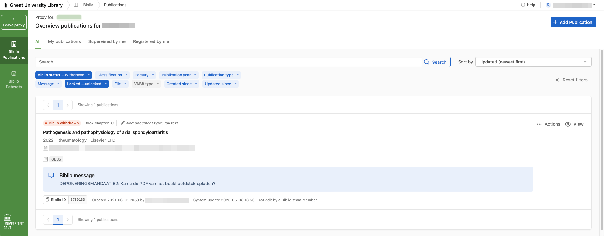

# Proxy Bèta handleiding

## Proxy worden

_De proxy functionaliteit is in bèta, wat betekent dat we nog heel wat moeten uitzoeken om ervoor te zorgen dat deze functionaliteit robuust genoeg is om voor de hele universiteit uit te rollen. We testen deze functionaliteit met een beperkte groep, om ervoor te zorgen dat deze klaar is voor een groot publiek._

Momenteel werken we met een kleine groep die deze functionaliteit test en feedback geeft, zodat we deze in de toekomst beter kunnen maken.


**Wil je deel van ons adviesbureau worden?**\
Stuur een mailtje naar [biblio@ugent.be](mailto:biblio@ugent.be). Als adviseur:

* Houden we je op de hoogte van de nieuwste features;
* geven je de kans om mee te bepalen waar Biblio als volgende project op in zet;
* en vragen je om feedback te geven op aankomende features.


### Proxieschap verwijderen of toevoegen

Stuur een mailtje naar [biblio@ugent.be](mailto:biblio@ugent.be).

## Proxy dashboard: overzicht bewaren

Proxies krijgen een overzicht van alle onderzoekers waarvan ze de bibliografie kunnen beheren:

<figure><figcaption>
Dashboard: overzicht van onderzoeksoutput met een belangrijke status voor elk van jouw onderzoekers.
</figcaption></figure>

### Overzicht onderzoeksoutput waar aandacht voor nodig is, per onderzoeker

* Je krijgt een **overzicht van onderzoeksoutput met een belangrijke status voor elk van jouw onderzoekers: publicaties, datasets, suggesties\***.
  * Je ziet onmiddellijk voor welke onderzoeksoutput er een aandachtspunt is:\
    **onderzoeksoutput met de status draft, withdrawn of suggestion\***.
  * Je kan met elke knop **rechtstreeks filteren op de status**.
* Je kan onmiddellijk naar een **overzicht van alle publicaties en datasets** gaan.

\*Suggesties/suggestions zullen vanaf eind november beschikbaar zijn voor alle faculteiten.


**Zoeken naar een bepaalde onderzoeker in het overzicht.**\
Voorlopig hebben we geen ingebouwde zoekfunctionaliteit. Met de toestcombinatie `ctrl+f` kan je de ingebouwde zoekfunctionaliteit van je browser gebruiken, en zoeken naar woorden op je pagina.


## Onderzoeksoutput bekijken, bewerken en toevoegen

Eens je vanuit het proxy dashboard naar de publicaties, datasets of suggesties gaat, wordt de zijbalk groen. Zo zie je onmiddellijk dat je in een andere omgeving zit.

<figure><figcaption>
Een bibliografie bekijken als proxy: de zijbalk wordt groen
</figcaption></figure>

Wat je hier kan doen

* Elk item **bekijken**.
* Elk item dat niet op locked staat **bewerken**.\
  Onderzoeksoutput bewerken gebeurt vanuit jouw naam.
* Nieuwe onderzoeksoutput **toevoegen**.
  * Onderzoeksoutput toevoegen gebeurt vanuit jouw naam.
  * De onderzoeksoutput wordt pas aan deze onderzoeker gekoppeld wanneer je bij het tabje “people & affiliations” deze persoon toevoegt als author, editor, supervisor of creator.

De balk wordt dan terug blauw om aan te duiden dat je vanuit jouw naam aan het bewerken bent.


**Vragen of feedback?**\
Stuur een mailtje naar [biblio@ugent.be](mailto:biblio@ugent.be).

