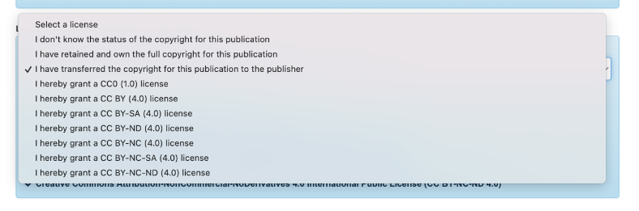
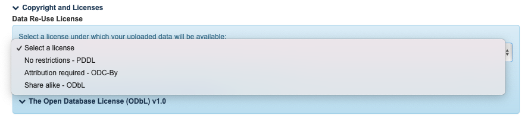

# Licenties \[EN]

## License mappings

| Back-office                                                       | Front-office                                                                                                       | oai                                                                                                                | Location                        | Info                                                                                                                                                | Old back-office                                                                                                                                                                                                                          |
| ----------------------------------------------------------------- | ------------------------------------------------------------------------------------------------------------------ | ------------------------------------------------------------------------------------------------------------------ | ------------------------------- | --------------------------------------------------------------------------------------------------------------------------------------------------- | ---------------------------------------------------------------------------------------------------------------------------------------------------------------------------------------------------------------------------------------- |
| `Empty selection`                                                 | **No license (in copyright)**                                                                                      | **No license (in copyright)**                                                                                      | 
Publications Datasets
 | _Reason: in the past this one has been used to indicate "other license" as well_                                                                    | `Empty selection`                                                                                                                                                                                                                        |
| **No license (in copyright)**                                     | **No license (in copyright)**                                                                                      | **No license (in copyright)**                                                                                      | Publications                    | _Reason: both old license options meant "there is no license, no reuse"_                                                                            | 
<strong>I have retained and own the full copyright for this publication</strong>  <strong>I have transferred the copyright for this publication to the publisher</strong>   <code>The above options are merged</code>
 |
| **I don’t know the status of the copyright for this publication** | **Information pending.**                                                                                           | **Information pending.**                                                                                           | Publications                    | /                                                                                                                                                   | I don't know the status of the copyright for this publication                                                                                                                                                                            |
| **The license is not in this list**                               | **A specific license has been chosen by the rights holder. Get in touch with the rights holder for reuse rights.** | **A specific license has been chosen by the rights holder. Get in touch with the rights holder for reuse rights.** | 
Publications Datasets
 | /                                                                                                                                                   | `Not an option in the old back-office`                                                                                                                                                                                                   |
| CC license option\*                                               | _Shows the chosen license e.g. Creative Commons Attribution 4.0 International Public License (CC-BY 4.0)\*_        | _Shows the chosen license e.g. Creative Commons Attribution 4.0 International Public License (CC-BY 4.0)\*_        | 
Publications Datasets
 | _FRIS use the SPDX ID standard. Translations are made somewhere (GISMO? FRIS); we might have to adapt in the future so we can follow the standard._ | CC license option\*                                                                                                                                                                                                                      |

### CC License options\*

* Creative Commons Public Domain Dedication (CC0 1.0)\
  SPDX: `CC0-1.0`
* Creative Commons Attribution 4.0 International Public License (CC-BY 4.0)\
  SPDX: `CC-BY-4.0`
* Creative Commons Attribution-ShareAlike 4.0 International Public License (CC BY-SA 4.0)\
  SPDX: `CC-BY-SA-4.0`
* Creative Commons Attribution-NonCommercial 4.0 International Public License (CC BY-NC 4.0)\
  SPDX: `CC-BY-NC-4.0`&#x20;
* Creative Commons Attribution-NoDerivatives 4.0 International Public License (CC BY-ND 4.0) \
  SPDX: `CC-BY-ND-4.0`
* Creative Commons Attribution-NonCommercial-ShareAlike 4.0 International Public License (CC BY-NC-SA 4.0)\
  SPDX: `CC-BY-NC-SA-4.0`
* Creative Commons Attribution-NonCommercial-NoDerivatives 4.0 International Public License (CC BY-NC-ND 4.0)\
  SPDX: `CC-BY-NC-ND-4.0`

### Screenshots

#### New Biblio

 Publications options

 Datasets options

#### Old Biblio

<figure><figcaption>
Publications: adapted
</figcaption></figure>

<figure><figcaption>
Datasets: completely replaced
</figcaption></figure>

#### OAI licenses

<figure><figcaption>
OAI for CC
</figcaption></figure>

<figure><figcaption>
OAI for no license
</figcaption></figure>

<figure><figcaption></figcaption></figure>

## GISMO Mappings

### Publications

<figure><figcaption></figcaption></figure>

### Datasets

This is a snippet

<figure><figcaption></figcaption></figure>
