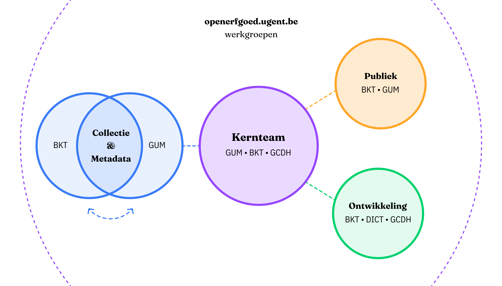
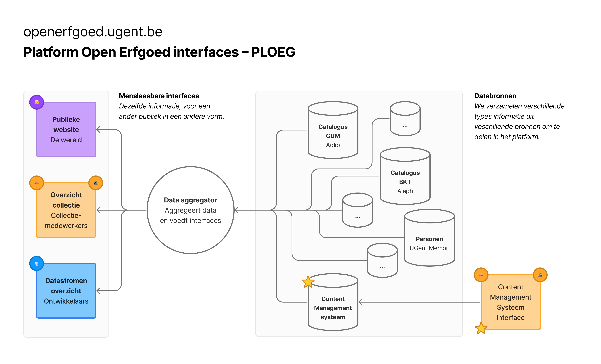

# Concept Openerfgoed.ugent.be

## Scope 2024: prototype

Briefing prototype:

{% embed url="https://ugentbe.sharepoint.com/:w:/r/teams/Group.PR202304094/Gedeelde%20documenten/General/openerfgoed.ugent.be/Analyses%20en%20ontwerp/Bauke/DynamischPrototypeBauke-Werkdocument-v2.docx?d=w5eba2bf317e3470382726f131272963d&csf=1&web=1&e=JtehUs" %}

### Aanpak

<figure><figcaption></figcaption></figure>

### Van data naar weergave

<figure><figcaption></figcaption></figure>

## Teams omgeving

Documenten en interne communicatie

{% embed url="https://teams.microsoft.com/l/team/19%3aweHa-md0R149oLdgQSjTbgfXu3HNBmxfv7izep4TC7c1%40thread.tacv2/conversations?groupId=5634160a-c77f-4926-b62b-39d9814a9799&tenantId=d7811cde-ecef-496c-8f91-a1786241b99c" %}
