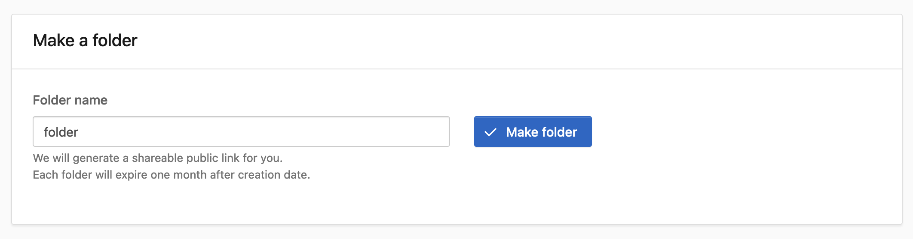
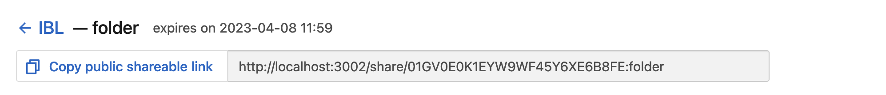
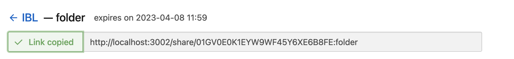
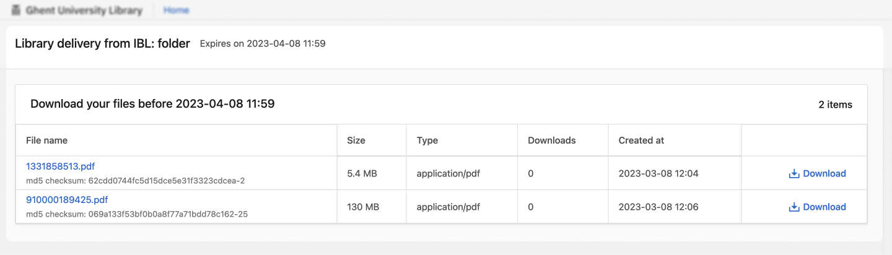
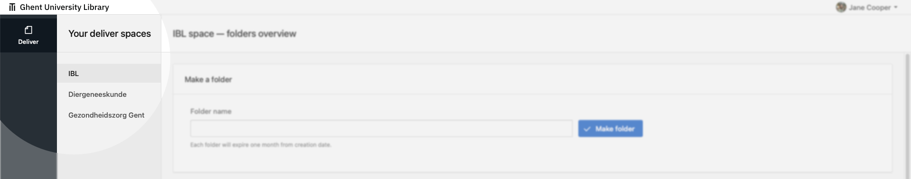
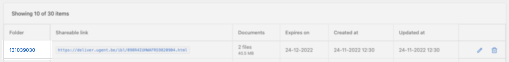
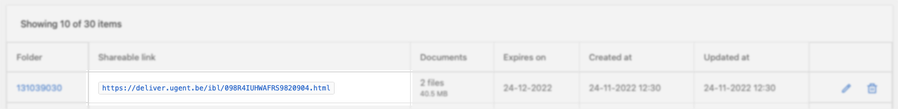
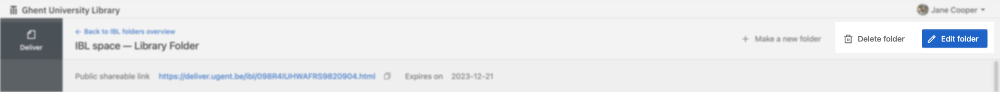

# Deliver handleiding

_Digitale ruimtes voor Bibliotheken, waarin we deelbare mappen kunnen aanmaken en beheren. In deze deelbare mappen kunnen bestanden van bibliotheken die niet publiek gedeeld mogen worden, verstuurd worden. Dit kan voor een bepaalde periode, voor en door bepaalde personen – op een beveiligde en stabiele manier._

## Snel aan de slag

1.  Surf naar [http://deliver.lib.ugent.be](http://deliver.lib.ugent.be/) en log in met je UGent account.\

    <figure><figcaption>
Rechts bovenaan kan je inloggen (en uitloggen).
</figcaption></figure>
2.  Je komt automatisch terecht in een _space_ waarin je folders kan aanmaken om bestanden mee te delen. \
    Heb je geen toegang? Stuur een mailtje naar [libservice@ugent.be.](mailto:libservice@ugent.be)\

    <figure><figcaption>
Links zie je de spaces waar je toegang tot krijgt.
</figcaption></figure>
3.  Maak een nieuwe folder aan. Deze vervalt na één maand.\

    <figure><figcaption>
Je foldernaam kan cijfers, tekens en letters bevatten. Zolang het een unieke naam is, ben je vrij om de naam te kiezen.
</figcaption></figure>

    <figure><figcaption>
De vervaldatum wordt automatisch gegenereerd.
</figcaption></figure>
4.  Laad een of meer bestanden tegelijk op.\

    <figure><figcaption>
Je kan de dropzone gebruken (niet via Athena), of op de knop klikken.
</figcaption></figure>

    <figure><figcaption>
Je kan meerdere bestanden tegelijk opladen.
</figcaption></figure>

    <figure><figcaption>
Je kan de voortgang bekijken van de files. Ververs de browser nie4t.
</figcaption></figure>
5.  Gebruik de publiek deelbare link om de bestanden te versturen naar je bestemmeling.\

    <figure><figcaption>
Je vindt de publiek deelbare link in het folder overzicht en bovenaan de folderpagina.
</figcaption></figure>

    <figure><figcaption>
Gebruik de knop om de link in één keer te kopiëren.
</figcaption></figure>
6.  De bestemmeling kan de bestanden downloaden via de gekopieerde link.\

    <figure><figcaption>
De folder vervalt na een maand.
</figcaption></figure>

## Deliver Spaces

Deliver heeft verschillende omgevingen, genoemd spaces, waarin je met je collega's mappen kan aanmaken om documenten mee te delen. Elke [faculteitsbibliotheek](https://lib.ugent.be/nl/libraries) binnen de Universiteitsbibliotheek heeft een eigen space.

<figure><figcaption>
In de linker zijbalk heb je een overzicht met alle space waar je toegang tot hebt gekregen.
</figcaption></figure>


### Toegang krijgen tot een space

Om toegang te krijgen tot een space, stuur een mailtje naar [libservice@ugent.be](mailto:libservice@ugent.be).


## Deliver folders (deelbare mappen)

In deliver spaces kan je deelbare mappen aanmaken om documenten in op te laden voor derden.

### Mappen maken

📂 Bovenaan de space krijg je de optie om een map aan te maken.\
🗓️  Elke folder vervalt na een maand, om de veiligheid te verhogen.

<figure><figcaption>
Interface voor het aanmaken van een folder.
</figcaption></figure>

### Mappen overzicht

#### Overzicht

📁 In je space zie je een overzicht van alle mappen in de space.\
👁️ Iedereen die toegang heeft tot een space, kan elkaars mappen zien in die space.\
ℹ️ Je ziet het aantal documenten, de grootte, vervaldatum, creatiedatum en bewerkingsdatum.

#### Acties

📂 Klik op de "Folder" naam om de map te openen.\
✍️ Pas de naam van de folder aan met de potlood knop.\
🗑️ Verwijder de folder met de prullenmand knop.

<figure><figcaption>
Overzicht van alle mappen of folders.
</figcaption></figure>

<figure><figcaption>
Klik op de folder naam om de folder te openen.
</figcaption></figure>

### Mappen delen

#### Met externe ontvangers (UGent of publiek)

Gebruik de "Public shareable link" om naar externe mensen te sturen die de inhoud van de map kunnen bekijken en de documenten downloaden. **Dit is een publieke link waar je zonder inloggen terecht kan om de documenten te ontvangen.**

Je vind de shareable link in het overzicht van je map, of in de map zelf.

<figure><figcaption>
De publieke deelbare link staat in het overzicht bij elke map.
</figcaption></figure>

<figure><figcaption>
De publieke deelbare link staat ook bovenaan in de map zelf.
</figcaption></figure>

Via de publieke deelbare link, kan iedereen de folder en bijbehorende files zien. Bewerken kan niet.

<figure><figcaption>
Interface van publieke deelbare link.
</figcaption></figure>

#### Met collega's

Gebruik de link in de browserbalk om naar je collega's te sturen. Zij zien, als ze toegang hebben tot de map, na inloggen dezelfde interface als jij.

### Mappen beheren

✍️ Pas de naam van de folder aan met de potlood knop in het overzicht, of in de map zelf.\
🗑️ Verwijder de folder met de prullenmand knop in het overzicht, of in de map zelf.

<figure><figcaption>
Verwijderen of bewerken van de map in de map zelf.
</figcaption></figure>

<figure><figcaption>
Verwijderen of bewerken van de map in het overzicht.
</figcaption></figure>

Je kan enkel de naam van de map aanpassen nadat je op bewerken hebt geklikt.

<figure><figcaption>
Bewerken van een map.
</figcaption></figure>

## Documenten opladen in een map

### Documenten opladen

In elke map kan je documenten tot 2GB opladen. Gebruik de knop "upload file" of drop een document in de dropzone om documenten op te laden.

👁️ Iedereen met de publieke deelbare link kan deze documenten zien en downloaden.\
🗳️ Enkel Bibliotheekmedewerkers met toegang tot de space kunnen documenten opladen in de folders van de space.\

<figure><figcaption>
Voeg een document toe via de knop, of gebruik de dropzone.
</figcaption></figure>

### Documenten monitoren en beheren.

Eens je een document hebt opgeladen, verschijnt deze in de lijst. Je ziet de naam van elk document, grootte, type, hoe vaak het document al werd gedownload en de creatiedatum.

Download het document door op de "file name" te klikken. Verwijder het document door op de prullenmand te klikken.

<figure><figcaption>
Files in de folder.
</figcaption></figure>

## Ontvangen van een publieke deelbare link naar een map

Via de publieke deelbare link, kan iedereen de folder en bijbehorende files zien. Bewerken kan niet.​

<figure><figcaption>
Interface van publieke deelbare link.
</figcaption></figure>


### Loop je vast, gaat er iets stuk?

Neem contact op met [libservice@ugent.be](mailto:libservice@ugent.be).

