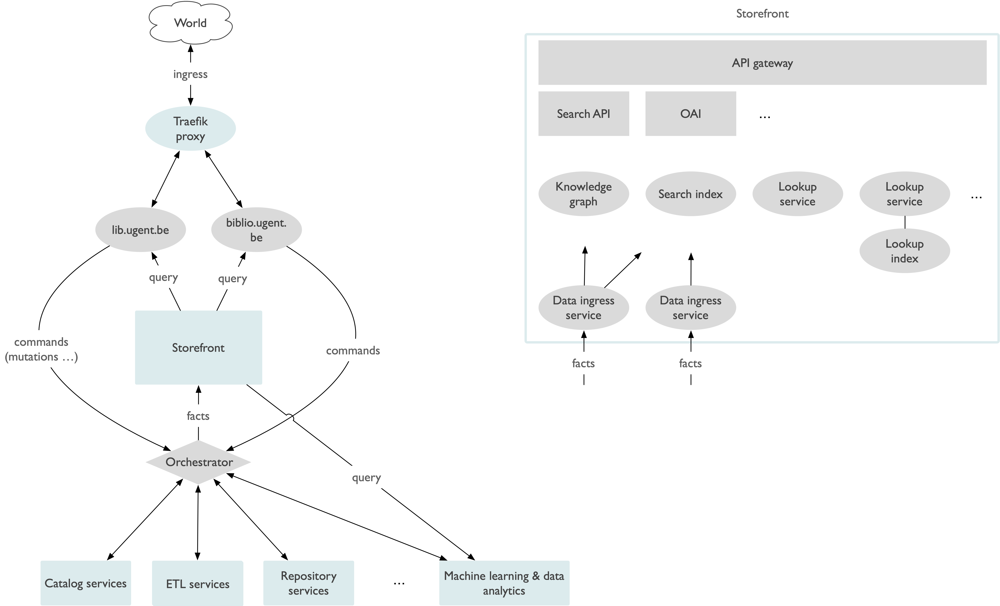

# Architectuur

## Algemene principes

Architectuur is een weerspiegeling van\
**werkprocessen en deeltaken** (systemen)
\
**die als geheel** (door koppelingen)
\
**waarde opleveren** (diensten leveren aan onze doelpublieken).

{% @figma/embed fileId="fEJGbDVHQ4rR6rpB0emvva" nodeId="6:224" url="https://www.figma.com/file/fEJGbDVHQ4rR6rpB0emvva/gitbook-architecture?type=design&node-id=6%3A224&mode=design&t=6r4eB5FNO4hFzrB0-1" %}

_Systemen die werkprocessen ondersteunen om een doel te vervullen:_\
_digital repository, institutional library services system, online bibliotheekcatalogus, ..._

_Werkprocessen die doelen vervullen:_\
_Catalografie, depotbeheer, digitale archivering, chapterscan,..._

## First drafts

<figure><figcaption>
Storefront
</figcaption></figure>

<figure><figcaption>
Biblio Infastructuur
</figcaption></figure>

<figure><figcaption>
Biblio Messaging
</figcaption></figure>

<figure><figcaption>
Biblio RW
</figcaption></figure>
